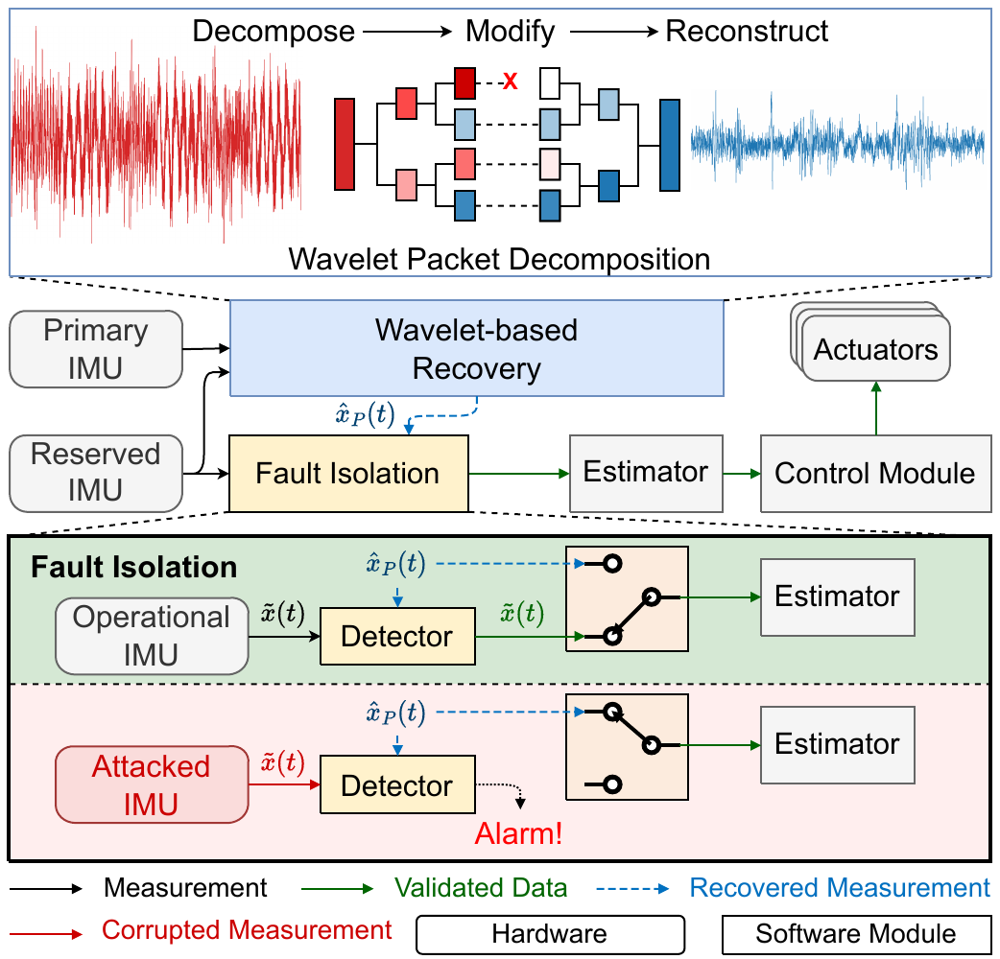

::: {.paper-header}

# WARA: Wavelet-based Realtime Recovery against Acoustic Injection Attacks on UAV

**Yunbo Wang** · **Cong Sun**<sup>✉</sup> · **Qiaosen Liu**

Xidian University · Xi'an, Shaanxi, China

<sup>✉</sup> Corresponding author: [suncong@xidian.edu.cn](mailto:suncong@xidian.edu.cn)

:::


## Key Contributions

::: {.contrib-grid}

::: {.contrib-card}
### 🎯 Multi-IMU Attacks
We develop a low-cost (\$28) attack device that simultaneously injects acoustic interference into multiple heterogeneous IMUs, bypassing physical shielding and IMU redundancy on commercial flight controllers.
:::

::: {.contrib-card}
### 🔬 Wavelet Recovery
**WARA** uses wavelet packet decomposition to isolate attack interference by amplitude. A redundant IMU instance preserves benign signal components — even if all IMUs are compromised.
:::

::: {.contrib-card}
### 🚁 Real-World Flights
Implemented on PX4 autopilot (CUAV V5+, Pixhawk 6C Mini). Real-world flight tests sustain stable flight for 2–5 minutes under acoustic attacks, far exceeding SOTA recovery durations.
:::

:::

<!-- ## System Architecture

{.lightbox width=100%} -->

## Featured Videos

::: {.video-grid}

::: {.video-card}
**Attack: Multi-IMU Remote Attack (Lab)**


:::

::: {.video-card}
**Attack: F330 Dual-IMU Attack on Vanilla ArduPilot**


:::

::: {.video-card}
**Recovery: F330 Real Attack Recovery with WARA**


:::

::: {.video-card}
**Recovery: ZD550 Real Attack Recovery with WARA**


:::

:::

## Cite This Paper

```bibtex
@inproceedings{wang2026wara,
  title     = {{WARA}: Wavelet-based Realtime Recovery against
               Acoustic Injection Attacks on {UAV}},
  author    = {Yunbo Wang and Cong Sun and Qiaosen Liu},
  booktitle = {To appear},
  year      = {2026},
  note      = {Preprint available on request}
}
```
