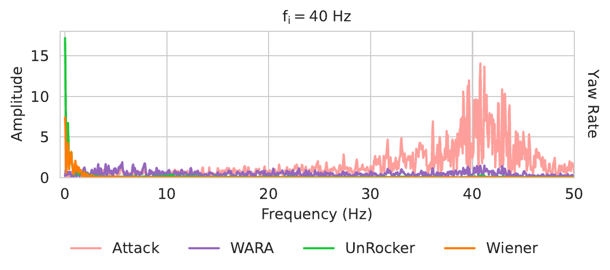

## Effective Recovery Duration

To compare all approaches on a common metric, we use **effective recovery duration** [@choi2020software]: the elapsed time from the first detection alarm ($t_{alarm}$) until the drone's estimated position deviates from the actual position by more than $\epsilon = 3$ meters — indicating loss of stable flight. This metric reflects *sustained operational safety under attack*, not merely signal-level recovery quality. All results below are measured in **HITL simulation** on the same hardware for fair comparison.

{.lightbox width=95%}

WARA achieves the **longest effective recovery durations** across all tested attack configurations. UnRocker's high processing delay prevents timely recovery even when its signal-level denoising is effective. VIMU's physical model degrades under strong attacks and sampling jitter. SpecGuard's RL controller cannot compensate when all IMU instances are simultaneously compromised. The classical filters — Butterworth, Savitzky-Golay, and Wiener — either fail to remove low-frequency interference or introduce motion signal distortion that shortens recovery duration. The following sections examine each comparison in detail.

## Comparison with UnRocker

**UnRocker** [@jeong2023rocking] is the SOTA deep-learning-based denoising approach that uses an autoencoder to remove attack interference from a sliding window of IMU measurements. Both methods run on a Raspberry Pi 3B+, the only board in our test suite with sufficient memory (1 GB) to load UnRocker's autoencoder model (1.43 MB). Since UnRocker lacks an attack detection mechanism, we activate both recovery processes immediately after the attack to eliminate detection delay as a confounding factor.

### The Process Delay Problem

UnRocker takes **35 to 56 ms** to process each IMU sample. This far exceeds the HITL sampling interval ($\Delta{t} = 4$ ms). Even without any acoustic attack, such a lengthy processing delay forces the drone into oscillation and eventually triggers a crash [@jeong2023rocking]. To verify, we set the attack amplitude to zero ($G_i = 0$) and run UnRocker's recovery — the drone still loses control quickly.

{.lightbox width=95%}

::: {.video-grid-3}

::: {.video-card}
**UnRocker: Attack → Crash**


:::

::: {.video-card}
**UnRocker: No Attack → Delay-Induced Crash**


:::

::: {.video-card}
**WARA: Recovery >300 s**


:::

:::

When an acoustic attack is active ($G_i = 1.0$ rad/s, $f_i = 20$ Hz), UnRocker's recovered measurements quickly deviate from the actual state, resulting in an immediate crash. In contrast, WARA's recovered measurements stay consistent with the actual state, achieving effective recovery durations exceeding **300 seconds**.

### Offline: Remote Gyroscope Attacks

To thoroughly compare recovery *quality* without the confounding effect of processing delay, we conduct an **offline evaluation**. Both methods are applied to the same compromised sensor data and compared against the ground truth.

::: {.fig-grid-2}

.png){.lightbox}

.png){.lightbox}

:::

Both methods effectively suppress the acoustic injection attacks — reduced sensor fluctuations and diminished attack signal peaks confirm this. However, UnRocker's recovered measurements **deviate from the drone's actual state**. When the actual pitch rate exceeds 1.0 rad/s, UnRocker returns near-zero output — the deep model distorts benign motion signals during recovery. The noise amplitude spectrum reveals new peaks in the 0–5 Hz band absent before recovery, confirming UnRocker introduces low-frequency signal distortion.

WARA's **orthogonal wavelet packet transform** preserves drone motion signals while efficiently removing induced signals. Because orthogonal WPD is an invertible linear transformation, it preserves the energy and details of the input — benign signal components pass through recovery intact.

### Offline: Touch-Based Real-World Attack

We further compare recovery against **touch-based acoustic attacks** on the ICM-42688P gyroscope sensor, where PZT discs are attached directly to the flight controller for stronger attack amplitudes.

{.lightbox width=95%}

{.lightbox width=95%}

### HITL: Accelerometer Attack

{.lightbox width=95%}

{.lightbox width=95%}

In both real-world and simulated attacks, UnRocker's recovery process consistently distorts drone motion signals — evidenced by noise amplitude peaks in the spectra and significant deviations in yaw rate and accelerometer measurements. The distortion is most pronounced with large-amplitude sensor signals.

{.lightbox width=95%}

UnRocker and the Wiener filter both introduce **new noise peaks in the low-frequency band** — distortions of the drone's motion signal. WARA's noise peak at lower frequencies, when present, has a considerably smaller amplitude.

## Comparison with Heuristic Filters

We compare WARA against three classical signal processing methods: **Butterworth** [@alexander2016digital] (2nd-order, 40 Hz cutoff, the PX4 default), **Savitzky-Golay** [@schafer2011savitzky] (polynomial order 6, window length 16, equivalent 40 Hz cutoff), and **Wiener** [@le2012consistent] (window length 255).

### Online SITL

Both Butterworth and Savitzky-Golay fail to remove the induced signal when the induced frequency falls **below their 40 Hz cutoff**. Reducing the cutoff further would capture low-frequency interference, but at the cost of increased control latency [@px42025filter] — directly compromising flight performance.

The Wiener filter effectively removes most induced signals, but its recovered measurements exhibit slower fluctuations and its noise spectrum reveals new peaks in the low-frequency band, causing the flight controller to overreact to attitude adjustments.

{.lightbox width=95%}

### HITL Results

The offline HITL results confirm the online findings. Butterworth and Savitzky-Golay cannot selectively filter out attack interference blended with motion signals. Wiener introduces low-frequency distortion — new peaks appear in the 0–5 Hz band after recovery. WARA isolates interference in the time-frequency domain, removing attack components while preserving motion signals intact.

{.lightbox width=95%}

{.lightbox width=95%}

{.lightbox width=95%}

{.lightbox width=95%}

## Comparison with VIMU

**VIMU** [@wang2024vimu] is the SOTA physics-based attack resilience (PBAR) approach. It predicts system states using a nonlinear physical model and replaces compromised IMU data with these predictions. Unlike UnRocker, VIMU meets real-time constraints on our FC boards, enabling direct online HITL comparison.

{.lightbox width=95%}

::: {.video-grid}

::: {.video-card}
**VIMU: HITL → Crash**


:::

::: {.video-card}
**WARA: CUAV V5+ HITL Recovery**


:::

:::

The drone equipped with VIMU quickly lost control and crashed shortly after the attack began. VIMU's recovery duration in HITL is shorter than simulation results reported in prior work [@wang2024vimu] because we apply a significantly larger attack amplitude (**4.0 vs. 0.6 rad/s**). Additionally, sampling jitter affects VIMU's physical model — the model predicts attitude changes per system control interval, but jitter disrupts the timing relationship between sensor samples and control updates.

## Comparison with SpecGuard

**SpecGuard** [@dash2024specguard] is the SOTA fault-tolerant control (FTC) approach. Unlike filter-based and PBAR solutions, SpecGuard does not directly recover compromised measurements. Instead, it employs a deep-RL robust controller that activates upon attack detection, aiming to keep the drone within predefined mission specifications (e.g., minimum flight altitude, position boundary). We deployed SpecGuard on Navio2@Raspberry Pi 3B+ for HITL simulation.

{.lightbox width=95%}

After the attack began, the drone quickly violated the minimum altitude specification and veered off the 10 m position boundary [@dash2024specguard], resulting in a short recovery duration (**< 10 seconds**). SpecGuard's performance degrades relative to reported simulation results [@dash2024specguard] because we apply the IMU attack to **all gyroscope instances** simultaneously — without reliable IMU measurements, the autopilot's state estimation is disrupted, defeating the RL controller's ability to maintain specifications.

