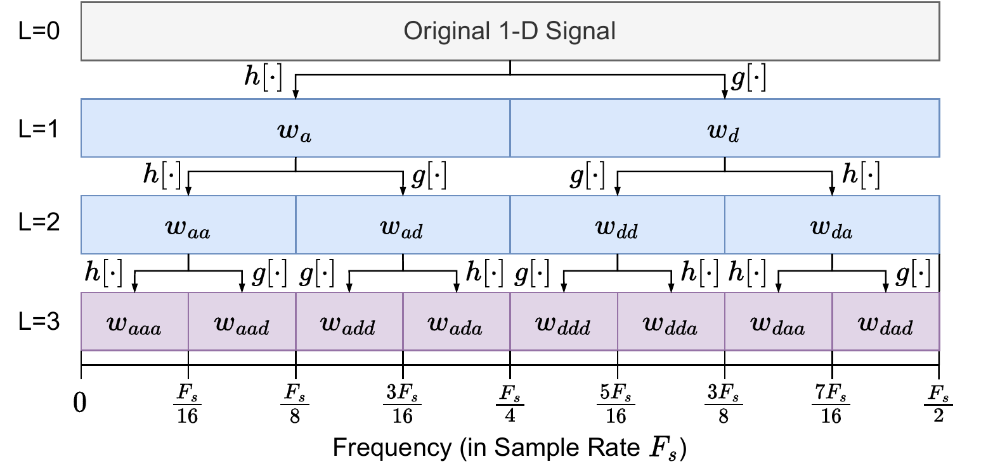

## Overview

WARA uses **wavelet packet decomposition** (WPD) to separate acoustic attack interference from benign sensor signals. Unlike classical wavelet transforms that only decompose low-frequency components, WPD decomposes *both* low- and high-frequency bands recursively, producing a full binary tree of sub-bands. This allows WARA to isolate attack interference localized in specific frequency bands while preserving the drone's motion signal.

{.lightbox width=90%}

## The Mallat Algorithm

WPD is implemented via the **Mallat algorithm**, which performs fast level-wise transformations using a pair of low-pass ($h[\cdot]$) and high-pass ($g[\cdot]$) filter banks. Given an input sequence $x[\cdot]$ of length $N$ and filter length $F$, the decomposition produces two sequences of wavelet coefficients:

$$w_{a}[k] = \sum^F_{i=0}x[2k-i]h[i];\quad w_{d}[k] = \sum^F_{i=0}x[2k-i]g[i]$$

where $k=0,1,...,\frac{N}{2}-1$, and $w_{a}[k]$ and $w_{d}[k]$ are the *approximate* and *detail* wavelet coefficients. The decomposition propagates recursively: approximate coefficients go to the left child and detail coefficients go to the right child in the WPT tree.

**Reconstruction** reverses the process using synthesis filters $h^*[\cdot]$ and $g^*[\cdot]$:

$$y[2k] = \sum^{F/2}_{i=0} (w_{d}[k{-}i]g^*[2i] + w_{a}[k{-}i]h^*[2i])$$

$$y[2k{+}1] = \sum^{F/2}_{i=0}(w_{d}[k{-}i]g^*[2i{+}1] + w_{a}[k{-}i]h^*[2i{+}1])$$

When the filter banks are **orthogonal** ($g[\cdot]\cdot g^*[\cdot]=h[\cdot]\cdot h^*[\cdot]=1/F$), the decomposition and reconstruction form an invertible linear transformation — WPD preserves the energy and details of the input signal. If $w_{a}[k]$ or $w_d[k]$ is missing, the corresponding term in the reconstruction is simply zero.

Decomposing to level-$L$ requires the input length to be an exact multiple of $2^L$. When the input is too short, we apply **reflect padding** at the tail to ensure continuity and alleviate edge distortion in the reconstructed signal.

## Online WPD with Buffer Mechanism

### Motivation

A naive WPD implementation stores *all* historical wavelet coefficients at every tree level, causing exponential space growth with tree depth — far exceeding the memory of typical FC boards. Processing all historical coefficients also exceeds their computational capacity. WARA addresses both problems with a **buffer mechanism** that reuses past computation results.

### Buffer Size Derivation

WARA's goal is to reconstruct only the latest induced signal estimate $\hat{A}_P(t)$ to compute the recovered measurement. According to the Mallat reconstruction equations, reconstructing at level-0 requires each level-1 node to provide at least $F/2$ wavelet coefficients. Let $m(L)$ be the number of coefficients each level-$L$ node must provide to level $L-1$:

$$m(L)=\left\{
\begin{array}{ll}
\frac{F}{2} & L=1 \\
\frac{F}{2} + \lceil \frac{m(L-1)-2}{2} \rceil & L\ge 2
\end{array}
\right.$$

The term $\frac{F}{2}$ accounts for reconstructing the last two outputs; $\lceil \frac{m(L)-2}{2} \rceil$ covers the remaining outputs. Since $\lceil \frac{m(L)-2}{2} \rceil < \frac{m(L)}{2}$, we can bound this by a simpler recurrence $n(L)$:

$$m(L) < n(L) = F\cdot(1-\frac{1}{2^L}) < F;\quad L\geq 1$$

Therefore, **storing the last $F$ wavelet coefficients at each node is sufficient** for flawless reconstruction of $\hat{A}_P(t)$. To keep these $F$ coefficients up to date, the decomposition requires $3F$ inputs. Reflect padding provides the last $F$ inputs, reducing the actual input length to $2F$.

### Buffer Design

Each WPT node maintains two buffers:
- **Decomposition buffer** (length $2F$) — stores recent sensor samples or parent coefficients for decomposition
- **Reconstruction buffer** (length $F+2$) — stores output coefficients for reconstruction (the extra 2 slots ensure proper data alignment)

Each node also tracks a **starting index** $i_{start}(t)$, initialized based on the node's level $L$ and filter length $F$:

$$i_{start}(0) = ((F-1) \gg L) \mathbin{\&} 1$$

where $\gg$ is bit-wise right-shift and $\&$ is bit-wise AND. When a new input enters the decomposition buffer, the index updates: $i_{start}(t) = (i_{start}(t-1)+1) \bmod 2$. When two new inputs arrive at a level-$L$ node, the decomposition buffer of its level-$(L+1)$ child shifts backward by one element to store the new wavelet coefficient. The starting index is then used to slice the correct subsequence from each buffer for wavelet decomposition and reconstruction — ensuring the online implementation remains consistent with the Mallat algorithm.

### Three Procedures

WARA's online WPD pipeline is driven by three procedures. Buffers shift forward as new sensor data arrives, and shift flags propagate from root to leaves, synchronizing computations across tree levels.

**1. Buffer Management (ManageBuffer)**

Each node's shift flag is determined by its parent: a child shifts its buffer only when the parent's buffer has shifted *and* the parent's starting index equals 1 (indicating two new inputs have been accumulated). If no shift is needed, the node is skipped. When a shift occurs, the buffer slides backward by one position, discarding the oldest sample.

**2. Online Decomposition**

For each new sensor sample $\tilde{x}(t)$:
1. Shift the root node buffer and insert $\tilde{x}(t)$ at the end
2. Traverse the tree depth-first. For each non-root node:
   - Manage buffer shift (propagated from parent)
   - Slice the parent's input buffer starting at $i_{start}(t)$
   - Apply the Mallat decomposition (Eq.1) to produce $w[k]$
   - Store the coefficients in the current node's buffer

**3. Online Reconstruction with Recovery**

For each new sample from the primary IMU:
1. Traverse the tree depth-first. At each leaf node:
   - If the node is **anomalous and LF**: subtract the corresponding coefficient from a redundant IMU instance, cancelling out benign motion while preserving the attack residual
   - If the node is **anomalous and HF**: zero out the coefficients (attack-only band)
   - If the node is **attack-free**: preserve coefficients as-is
2. When both children of a parent node are ready, reconstruct the parent's output via the Mallat synthesis equations (Eqs.2–3), propagating upward
3. Read the recovered attack estimate $\hat{A}_P(t)$ from the root node's reconstruction buffer
4. Return $\hat{x}_P(t) = \tilde{x}_P(t) - \hat{A}_P(t)$ — the recovered benign measurement

## WPT Partition

The partition of wavelet packets determines which frequency bands are monitored for attack interference. We use the **Symlets 2** wavelet ($F=4$) [@daubechies1988orthonormal] and configure the WPT based on the drone's motion signal characteristics.

{.lightbox width=95%}

### Frequency Band Allocation

<table style="width:100%;border-collapse:separate;border-spacing:0 4px;">
<colgroup>
  <col style="width:22%">
  <col style="width:14%">
  <col style="width:16%">
  <col style="width:48%">
</colgroup>
<tr><th>Band</th><th>Range</th><th>Depth</th><th>Purpose</th></tr>
<tr><td><b>LF (Low Frequency)</b></td><td>0–20 Hz</td><td>Level 6</td><td>Captures drone motion signals (0–5 Hz) plus low-frequency attack interference near the motion band. Decomposed deeper for fine-grained isolation.</td></tr>
<tr><td><b>HF (High Frequency)</b></td><td>20–100 Hz</td><td>Level 4</td><td>Captures attack interference above the motion band. Shallower depth saves computation.</td></tr>
<tr><td><b>Rejected</b></td><td>&gt;100 Hz</td><td>—</td><td>Removed by the autopilot's hardware low-pass filter; not processed.</td></tr>
</table>

The LF band is slightly broader than the motion signal band (0–5 Hz) to accurately capture attack interference that falls *within or near* the motion signal frequencies — the most critical type of interference for flight stability.

### Single-IMU vs. Multi-IMU Mode

The assignment of level-6 wavelet packets depends on whether a redundant IMU instance is available:

**Single-IMU mode:** Wavelet packets $w_{aaaddd}$ through $w_{aaadad}$ are designated as **HF attack packets** and zeroed out during recovery. The remaining level-6 packets are preserved as-is to retain the motion signal. This conservative approach avoids distorting benign data but cannot remove low-frequency attack interference.

**Multi-IMU mode:** All level-6 wavelet packets are treated as **LF attack packets** and replaced with the corresponding coefficients from a redundant (reserved) IMU instance. Since the reserved IMU is unlikely to experience the *same* attack interference in the exact same time-frequency bins, its coefficients provide a clean substitute — enabling removal of even low-frequency interference without distorting the motion signal.
